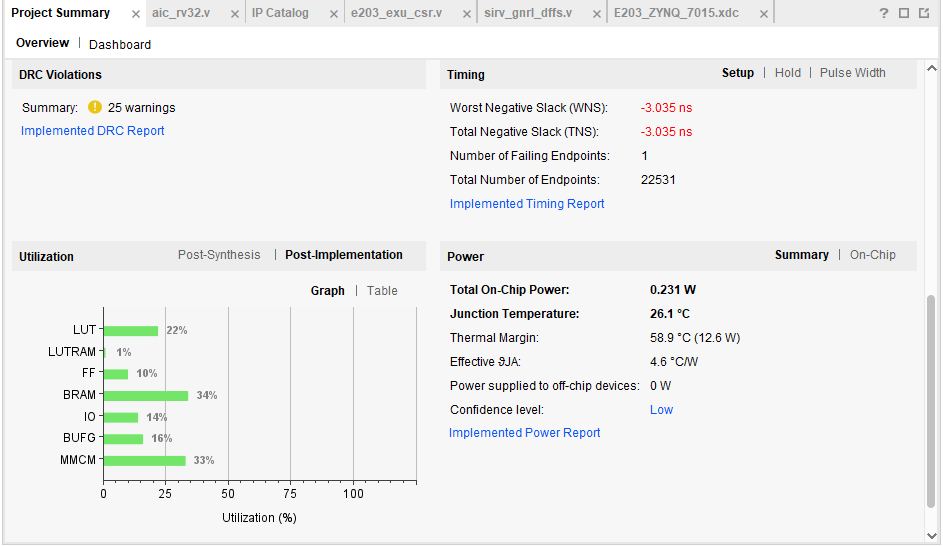

### 第一部分(概念与背景)
"CPU"在书中和“处理器”（processor）是相同的意思，通常是一个完整的SoC，有其他存储器等设备
"CPU core"="处理器核"="core"的概念，则是指的处理器中最核心的部分（所谓的真正的"处理器内核"）

区分CPU的主要标准——**指令集架构（ISA）**

[指令集架构有时简称为“架构”或者“处理器架构”]，图1-1是一个抽象层定义，相当于指令集架构(ISA或者说，“架构”)的概念范围

处理器的具体硬件实现方案称为**微架构** (microarchitecture)

#### CISC和RISC定义
指令集架构主要分为复杂指令集 (Complex Instruction Set Computer, CISC) 架构和精简指令集 (Reduced Instruction Set Computer, RISC) 架构

- CISC 架构不仅包含了处理器常用的指令，还包含了许多不常用的特殊指令。
- RISC 架构只包含处理器常用的指令，而对千不常用的操作，则通过执行多条常用指令的方式来达到同样的效果。

> 典型程序运算过程中用到的 80％指令，只占所有指令类型的20%。也就是说， CISC架构定义的指令中，常用的只有20%, 80％的指令则很少用到。

> **注意：**  
处理器指令集架构的位数和指令的编码长度无任何关系。并不是说 64位架构的
指令长度为 64 位，这是一个常见的误区。从理论上来讲，指令本身的编码长度越短越好，
因为这可以节省代码的存储空间。因此即使在64位的架构中，也存在大量 16位的指令，且
基本上很少出现64位的指令。

#### microcode（微码）
事实上， Intel 公司通过内部“微码化”的方法克服了 CISC架构的部分缺点

“微码化”是指将复杂的指令先用硬件解码器翻译成对应的内部简单指令（微码）序列，然后送给处理器流水线的方法。

> 它使x86架构的处理器核也变成RISC架构的形式，从而能够借鉴RISC架构的优点。不过，额外的硬件解码器同样会带来额外的复杂度与面积开销，这是x86架构作为一种 CISC架构不得不付出的代价。

#### CPU的使用领域
传统上， CPU主要应用千3 个领域－
~服务器领域、 PC领域和嵌入式领域。

#### 什么是嵌入式？
嵌入式领域是除服务器和 PC 领域之外，处理器的主要应用领域。所谓“嵌入式”是指，在很多芯片中，所包含的处理器就像嵌入在里面不为人知一样。

近年来，随着各种新技术的进一步发展，嵌入式领域本身也分化成几个不同的子领域。
- **移动领域**：随着智能手机和手待设备的发展，移动领域逐渐发展成规模可匹敌甚至
有可能超过PC 领域的一个独立领域，主要由 ARM 的 Cortex-A 系列处理器架构所
垄断。由千移动领域的处理器需要加载Linux操作系统，同时涉及复杂的软件生态，
因此它和PC领域一样，对软件生态严重依赖。
- **实时 (real time) 嵌入式领域**：该领域相对而言没有那么严重的软件依赖性，因此没有形成绝对的垄断。
- **深嵌入式 (deep embedded) 领域**：该领域的市场非常大，但往往注重低功耗、低成本和高能效比，无须加载像Linux这样的大型应用操作系统，软件大多需要定制的裸机程序或者简单的实时操作系统，因此对软
件生态的依赖性相对较低。

综上所述，由千移动领域逐渐成为一个独立的分领域，因此现在通常所说的嵌入式领域
是指深嵌入式领域或者实时嵌入式领域。

#### RISC-V的"V"是什么意思
RISC-V 是一种全新的指令集架构。 ”V" 包含两层意思，一是这是加州大学伯克利分校
从RISC I 开始设计的第五代指令集架构；二是它代表了变化 (variation) 和向量 (vector)。

#### RISC-V的设计理念
PJSC-V 架构的设计理念是什么呢？答案是“大道至简"。

#### 简洁的存储器访问指令
> 与所有的RISC架构一样， RISC-V架构使用专用的存储器读 (load) 指令和存储器写 (store)指令访问存储器 (memory)，使用其他的普通指令无法访问存储器，这种架构是RISC 架构常用的一个基本策略。

- 存储器访问的基本单位是字节 (byte)
-  RISC-V 架构的存储器读和存储器写指令支持以一字节 (8 位）、半字half word(16位）、单字word(32 位）为单位的存储器读写操作。 64 位架构还可以支持以双字 double word(64 位）为单位的存储器读写操作。
- 为了提高存储器读写的速度， RISC-V架构推荐使用地址对齐的存储器读写操作，但
是也支持地址非对齐的存储器操作RISC-V架构。
- 山千现在的主流应用是小端 (little-endian) 格式，因此RISC-V架构仅支持小端格式。
- RISC-V 架构的存储器读和存储器写指令不支持地址自增自减模式。(虽然性能上不是最快，但是降低了处理器设计的难度)
- RISC-V 架构采用松散存储器模型 (relaxedmemory model)，松散存储器模型对千访问不同地址的存储器读写指令的执行顺序没有要求，除非使用明确的存储器屏障
(fence) 指令加以屏蔽。

#### 存储器模型定义
——为了能够向上层软件明确地指出多核程序访问共享数据的结果，在指令集架构中便引入了存储器模型的概念。

这里引出3种代表性的存储器模型——  
按序一致性模型 (sequentialconsistency model)  
松散一致性模型 (relaxed consistency Model)   
释放一致性模型 (release consistency model) 

### [*插入章*]，书中提及的两个RISC-V软件工具链项目
都在github上可以找到

1. riscv-tools(它包含了 RISC-V仿真器和测试套件等子项目)  
其中：
- riscv-isa-sim 是基千 CIC+＋开发的指令集模拟器，它还有一个更通俗的名字—一
"Spike"
- riscv-opcodes 是一个 RISC-V 操作码信息转换脚本
-  riscv-openocd 是基于 OpenOCD
的 RISC-V 调试器 (debugger) 软件
-  **riscv-pk 为 RISC-V 可执行文件提供运行环境，同时提供最简单的bootloader**
-  **riscv-tests 是一组 RISC-V 指令集测试用例**

2. riscv-gnu-toolchain(它包含了 RISC-V 的 GNU 相关工具链等子项目)
其中：
-  riscv-gcc 表示 GCC
-  riscv-binutils 是一组二进制程序处理工具（链接器、汇编器等）
-  riscv-gdb 表示 GDB 工具
-  riscv-glibc 是 Linux 系统下的 C 标准库实现
- riscv-newlib 是面向嵌入式系统的C标准库实现
- qemu是一个支待RISC-V 的QEMU模拟器，有关QEMU模拟器的更多信息请饮者自行查阅。

#### 除此之外
如需使用 RJSC-V 的工具链，除按照 GitHub 上的说明下载源代码并进行编译之外，你还可以在网络上直接下载已经预先编译好的GNU工具链和Windows IDE开发工具。

图 2-8 （预编译好的RISC-VGNU 工具链和 WindowsIDE 工具）
所示为芯来科技在其官方网站的文档与工具页面中所提供的预编译好的 RIISC-V GNU 工具
链和 Windows IDE (Nuclei Studio IDE) 工具。关于 GNU 工具链的更多信息，请参见《手把手教你RISC-V CPU （下）一工程与实践》。

#### 开源综述
> 注意， RISC-V是一种开放的指令集架构，而不是一款具体的处理器。任何组织与个人均可以依据RISC-V架构设计实现自己的处理器，或高性能处理器，抑或低功耗处理器。
"只要是依据RISC-V架构而设计的处理
器，就可以称为RISC-V架构处理器。"

1. Rocket-chip生成器可以生成的两款处理器核：rocket core和rocket boom

### 蜂鸟E203大体说明
图4-2 是蜂鸟 E203 处理器系统的概述图(模块级)

图4-3 是蜂鸟 E203 处理器配套的SoC的结构（即处理器在硬件电路上扩展的概述图）

表4-1是蜂鸟 E203 处理器的性能指标

表4-2蜂鸟 E203处理器配套的 soc 的特性

表4-3 是 config.v 的具体配置选项中的宏（解释/注释）

### 第二部分（设计思想/基础概念/设计思路/设计理念）

5.1节说明了需要的背景知识

5.2节是E203的设计理念：
- 模块化和可重用性
- 面积最小化
- 结构简单化
- 性能不追求极端

蜂鸟 E203 处理器核采用一套统一的**Verilog RTL 编码风格 (coding style)**，该编码风格
来自严谨的工业级开发标准，其要点如下。
1. 使用标准DFF模块例化、生成寄存器。(DFF模块类似于一个专门的函数， D Flip-Flop (D 触发器))
2. 推荐使用 Verilog 中的 assign 语法替代 if-else 和 case 语法。

#### [插入一个层级关系]

可以这样理解数字电路设计的不同抽象层次：

- 系统级 (System Level):
    - 描述整个系统的功能和模块划分，不涉及具体的电路实现。
    - 例如：一个计算机系统可以划分为 CPU、内存、输入/输出设备等模块。

- 架构级/微架构级 (Architecture/Microarchitecture Level):

    - 描述系统的架构和组成，如 CPU 的指令集架构 (ISA)、流水线结构、缓存设计等。

    - 这仍然是比较抽象的层次，不涉及具体的门电路。

- 寄存器传输级 (Register Transfer Level, RTL):

    - 描述数据如何在寄存器之间流动，以及如何通过组合逻辑进行处理。

    - 使用硬件描述语言（如 Verilog、VHDL）进行描述。

    - RTL 代码是可综合的，可以转换成门级网表。

- 门级 (Gate Level):

    - 描述电路的逻辑门连接关系。

    - 使用逻辑门（如与门、或门、非门、异或门等）来表示电路的功能。

    - 门级网表是综合工具的输出，也是布局布线工具的输入。

- CMOS 电路级 (CMOS Circuit Level):

    - 描述逻辑门的具体 CMOS 晶体管实现。

    - 使用 PMOS 和 NMOS 晶体管来构建逻辑门。

    - 这一层更接近物理实现，需要考虑晶体管的尺寸、连接方式、寄生效应等。

- 版图级 (Layout Level):
    - 描述电路在硅片上的具体物理实现, 包括每个晶体管, 连线的位置, 尺寸等.

——from Gemini 2.0 pro Experimental 02-05

> 第五章相当于E203的概述再往下了一层的描述，内容更多了不少，这里不做记录


---

### 第三部分，实战(引言)
再复制一下自己的板子参数：
xc7z015clg485-2  485  150  46200  92400  95  0  160  32  4  4  0*12  1  3  0  0.95  0.95  1.05
发现lut和DD资源数几乎是7010(UP主的)的三倍

由于官方的还是对他自己的板子做的支持完善一些（DDR200T开发板和MCU200T开发板），还是决定参考视频（在Zynq 7010上做的，跟我现在手上这个7015B很像，也许能跑，但是还少一些辅助硬件{调试器、USB转TTL、杜邦线}不知行不行）https://www.bilibili.com/video/BV1ia411U76P/?spm_id_from=333.337.search-card.all.click&vd_source=2e347744adefa61fe331f93e747e09b5

#### 首先介绍作者改的system.v
顶层代码，去掉一些不必要的（注释掉）

最重要的口连接上：时钟（必须的）、复位引脚（必须的）、串口（uart）、Jtag下载调试口
Led与外设口（GPIO）是其次的

串口很重要，需要printf与scanf等打印调试信息的时候，就是通过串口打印

#### 作者使用的ip
Xilinx的ip，clock waizer的时钟，代码中（aic_rv32.v）是取名为PLL，ddr200t中是mmcm的名字(system.v)

- RTC：Real Time Clock

IOBUF这个ip是Xilinx的原语

#### 自己怎么改system.v代码以在自己的板子上跑起来
看自己的板子的原理图
1. 分配的管脚（排针？通过原理图里的对应关系，找到一个字母加数字的组合），写入xdc约束文件中(这个时钟和串口等的格式是固定的)

#### 作者移植过程
开始时间：  
21：22

### 一次实战（移植E203_P1的具体操作步骤）

#### 开发配置基调
几乎不支持任何中文路径——不论是代码还是开发环境的位置。使用Windows做实验的用户需要格外注意

#### 第一步-创建IP——PLL
Vivado检测到的顶层文件aic_rv32中的sys_clk_gen:xil_defaultlib.PLL没有被检测到

在IP Catalog中添加这个IP：搜索得到FPGA Features and Design->Clocking->**Clocking Wizard**这个IP,生成时钟的PLL（这句话到底是啥意思）  

> 注：添加的IP的名字需要与设计文件中的命名保持一致（这里添加的IP的名字，类似于面向对象语言中的类名）。例如这里的就叫PLL

> 另一个注：up主写的是50MHz的时钟，因为它的板子上是这样的。而我也保持这一设置，因为7015上有两个系统时钟，PS的33.333MHz，PL的50MHz，应该是一样的。时钟名字与aic_rv32.v的PLL里的变量名保持一致  

> 输出时钟的话，有两个，一个16MHz，一个是8.388MHz

> 复位模式(Reset Type)是低电平(Active Low)

```
遇到一个warning，提示clk_ou1的16MHz无法达到，最接近的是15.99757MHz，与视频中流畅的配置过程不同
```

然后generate

#### 第二步(感觉不是必要的，对于在FPGA上跑来说，但是看看仿真也是很有必要的)-介绍修改的仿真文件e203_tb_top.v以及Vivado仿真项目(打印hello world)
NucleiStudio环境是up配好的(这个IDE是Java写的，有一个芯来科技自己的userguide)，解压即可使用（至少支持Windows吧，up用的看起来是win10）——并不是，缺少sdk_hbird_sdk这个  

从https://doc.nucleisys.com/hbirdv2/quick_start/sdk.html的4.3.2.1上执行操作，注意RISC-V GNU Toolchain改名字了"Nuclei RISC-V Embedded Toolchain(Baremetal/RTOS + Newlibc)"

然后在你放置NucleiStudio的地方，现在说的是nuclei-tools文件夹/但是视频中的我推断是tools文件夹中，创建gcc，openocd，build-tools文件夹,然后分别解压对应的下载压缩包，放进对应的文件夹中——注意调整文件路径符合官方文档  

上述好像不是必要的，应该参考4.3.2.3。。。

得，up主的这个studio版本，toolchain文件夹是官方的\<nuclei-tools>文件夹

好像又看错了，应该看4.5，直接去官网下载Nuclei Studio IDE，整个新的studio算了，得，2024版本的都不支持蜂鸟的sdk，gcc编译还有啥的都有问题，又用回了2022-04版本的studio

取消了helloworld模板中的print_misa函数，只相当于只有一个for循环打印

> **注**：  
up的板子没有flash，所以download mode是从内部的ROM启动的ILM download mode（不知道这里的描述是否准确）。后续可能会与FPGA上跑的不太一样，这里先按照原步骤来

build helloworld项目后，这个IDE会生成{your_project_name}.elf和{your_project_name}.hex文件

需要手动添加生成仿真文件的指令，gen_simcode.txt中有，使用的是gnu工具链中的objcopy工具。这里放一下，直接在这里复制的话也许会出问题?  
```
riscv-nuclei-elf-objcopy -O verilog "${BuildArtifactFileBaseName}.elf" "${BuildArtifactFileBaseName}.verilog";sed -i 's/@800/@000/g' "${BuildArtifactFileBaseName}.verilog"; sed -i 's/@00002FB8/@00002000/g' "${BuildArtifactFileBaseName}.verilog";
```

为啥把注释删掉才有.verilog生成？也没有报错，好奇怪。折磨

生成的仿真文件叫{your_project_name}.verilog，copy到vivado项目下吧，方便

然后实际的仿真代码文件e203_tb_top.v需要读取这个.verilog文件，而后面将e203_tb_top.v添加到项目的simulation中的时候，就不用管这个.verilog文件了

添加后，需要将e203_tb_top.v手动设置为顶层文件

然后可以试试跑一下仿真了,Run Simulation(behavior级别即可)

可以看到波形图中，gpioA_o_17的后20个稳定的输出可以对应上printf函数(但是up的结果是乱的，没有规律？)——仿真成功了！

```
似乎这一步因为是模拟的，所以依赖的东西不是很多，总结一下大概是：
1. Vivado
2. NucleiStudio环境以及工具链包（这两个up都帮我们准备好了）
3. NucleiStudio环境下生成的.verilog文件以及其读取路径的修改

环境冲突的可能性不是很大
```

testbench文件(e203_tb_top.v)中，finish条件需要很长时间，所以手动停止仿真  

gpio 16是uart0:rx  
gpio 17是uart0:tx，所以相当于反映了printf函数的行为  

波形图的话，是逐个个bit发送的，也看不出来（可能和uart协议相关），还是得看log信息/Tcl Console


#### 第三步-添加约束文件-并生成bitstream

up的E203_ZYNQ_7010.xdc是已经写好的，但是需要改  

UP展示了vivado的Language Templates里的模板(IOBUF这个IP就可以在这里面搜索到)，其中包括xdc约束文件的

```
7010是Artix-7系列的
```

> UP没有详细讲这一步，只说这些都可以搜到，那我只能自己改了...好消息是up给出了自己的板子的原理图，所以能参考的东西应该都有了
> ,得加上一本用户手册

> 但是遇到一个问题：我没有Jtag调试的那个硬件，这里该忽略掉吗？  
> TCK,TDO,TMS,TDI,GND的口插上  
> 串口(这里也是有的，板子自带的)  
> 然后这两个外接的设备也都连接到开发PC上

> 我又仔细一看自己的板子，UART和JTAG口都有连接了，所以似乎没有问题？那个调试器，就是JTAG口上连接的东西

> 那就可以开始看看需要怎么改xdc文件了

> 不对，xdc中有TMS,TDI,TDO,TCK这四个绑定的，忽略掉吗？

> 有一个问题，该连接核心板上的USB转串口还是底板上的？

```
核心板 vs. 底板上的 USB 转串口：

- 核心板上的 USB 转串口：

    - 核心板上的 USB 转串口通常用于 FPGA 的 JTAG 调试和配置。

    - 它可能连接到 FPGA 内部的 JTAG 调试模块，用于下载程序、调试代码、观察内部信号等。

    - 这个接口通常不用于通用的 UART 通信。

- 底板上的 USB 转串口：

    - 底板上的 USB 转串口通常连接到 FPGA 的通用 I/O 引脚，并配置为 UART 接口。

    - 这个接口用于与外部设备（如 PC）进行 UART 通信，例如：

        - 打印调试信息 (printf)。

        - 接收来自 PC 的命令。

        - 与传感器、模块等进行通信。

    - 在蜂鸟 E203 的移植中，UART0 通常用于输出调试信息和与主机进行交互，因此应该使用底板上的 USB 转串口。

——from Gemini 2.0 pro Experimental 02-05
```

```
GND指的是ground或grounding，接地的意思
```

> 时钟√，Rst改成了PS_KEY，Debug JTAG的四个特殊的先注释掉，UART0改为底板上的UART；GPIOA的led，KEY，40P都是照猫画虎，后面的OLED Display暂时删去了——看看这个能不能生成bitstream——为啥视频里30s就生成好了，我的过了3min还在综合？——好的，过了5min，综合是成功了，但是imp报错了，资源占用率和up的差不多  

> ---果然还是得绑定好，gpioA_20到25都有问题，还有tck那四个也有问题，uart0的那两个也有问题(但先不管这两个)---

> 决定把set_property CLOCK_DEDICATED_ROUTE FALSE [get_nets IOBUF_jtag_TCK/O]的注释解除

> 把那六个顺着40p往上绑

> 那4个特殊的，就再往上接着绑——好，再试一次——又报错了，这次完全不一样，在place holder阶段出的错，看上去是mcu_rst和uart0_rx和uart0_tx的问题，难道rx和tx绑反了？关于每次综合过程非常长的原因，我感觉是并行化没用上的问题，警告那也说了并行综合有问题，而且看本机的CPU核也只有6个左右用了20%（选的是16核综合），所以每次要30sX10=300s=6min的时间

> 交换了一下uart的rx和rt也还是一样的报错，看来不是绑反了的问题

> 仔细看了看，觉得可能是电压的问题，有问题的地方改为+1.8v试试

> 好像也不是电压的问题，把uart改为核心板上的引脚试试

> 把tck那些改一改，改成用户手册上的。等会，突然之间，我找到名字和原理图上一模一样的了（例如IO_L16P_T2_34在bank34上，IO_L16P_T2_13在bank13上），试试这样改会怎样，坏了，7015B居然也有bank34,得重改..

> 不过似乎还是reset和uart的问题，将reset改为PL_key，顶层文件中的PL_key删掉把(gpioA_4，相关的也都注释掉——IOBUF)，顺便把uart改回底板上的

> 嗯，reset的严重警告消失了，但是还剩下两个uart的严重警告和报错。复刻一下up的原理图的引脚位置试试——成了！！（结果还是绑到扩展口上了）

记录一下这次的参数：
```
综合时间：3:54
impl时间：2:10

Methodology：1006CW, 78Warn
Total Power：0.231

Lut：10333(synth)->10138，
FF：9357->9355
BRAM: 32
```



#### 第四步，上板子跑点什么
把uart线连接到核心板上，电源灯会亮起

program device的过程很快啊，1s吧

> 然后进入那个studio，在下载程序之前，先连接串口(在上方window的show view中找到terminal，在新出现的窗口中，点击小电脑图标)

> 由于up板子上没有flash，所以选的是从rom启动（读指令），这里也跟着做修改

> ber，我这个完全跑不了啊。哦，原来是跑的东西不对，得选择hello_world_debug_openocd，而不是.elf

> 嗯，感觉只差最后一步了，Info : D2xx device count: 1，这里我应该只缺把正确的硬件调试器插到板子的扩展口上了

> 后面再进行一些修改，uart连到核心板上，jtag的四个口子连到扩展口上


> 后面一块解决了很多问题，但发现还是找不到设备。可以断定就是缺一个调试器——（暂时搁置了，等东西到）(或者是程序问题，昌骏坚持认为，得改verilog)

> 换了硬件调试器，看来得改config文件

> 用的两个替代视频里的调试器是，一个Xilinx自己的红红的，一个是sipeed RV debugger plus（结果是针对BL702的一个CPU设计的）


> 那个openocd超时的问题应该是usb协议不兼容，调试器上的东西没有被主机全部检测到(例如一个调试、一个下载，在一个usb口上只出现一个com设备)

> 但现在的问题是：Error: Unsupported DTM version: 15，
> 参考这个试一试，增加一行xdc约束 https://www.riscv-mcu.com/community-topic-id-1052.html，似乎没有用
> 现在可以确定这里是CPU没有正确连上调试器
> 似乎是没装驱动的问题，https://ftdichip.com/drivers/d2xx-drivers/,好像也不是

> 重新插拔了好几次后就又出现" unable to open ftdi device with vid 0403, pid 6010, description '*', serial '*' at bus location '*'"的问题了（这个好像要等一会，就解决了，估计是识别没那么快）

> 我驱动可能装错了？https://visualgdb.com/UsbDriverTool/，驱动装了后，没有tring 什么什么了，但是报错还是存在

> 得：直接装蜂鸟调试器后（第四个调试器），JTAG连接上了。用的随便一个USB转TTL，能被检测到就行(注意代码里的TX连接CPU的rx口)


#### 输出信息记录
```
Open On-Chip Debugger 0.11.0+dev-01897-gc8fc2a168 (2022-04-01-04:46)
Licensed under GNU GPL v2
For bug reports, read
	http://openocd.org/doc/doxygen/bugs.html
DEPRECATED! use 'adapter speed' not 'adapter_khz'
DEPRECATED! use 'adapter driver' not 'interface'
Info : libusb_open() failed with LIBUSB_ERROR_NOT_FOUND
Info : no device found, trying D2xx driver
Info : D2xx device count: 3
Info : Connecting to "(null)" using D2xx mode...
Info : clock speed 1000 kHz
Info : JTAG tap: riscv.cpu tap/device found: 0x1e200a6d (mfg: 0x536 (Nuclei System Technology Co Ltd), part: 0xe200, ver: 0x1)
Info : Examined RISCV core; XLEN=32, misa=0x40001105
Info : starting gdb server for riscv.cpu on 3333
Info : Listening on port 3333 for gdb connections
Info : [riscv.cpu] Found 0 triggers
halted at 0x800000b2 due to debug interrupt
Started by GNU MCU Eclipse
Info : Listening on port 6666 for tcl connections
Info : Listening on port 4444 for telnet connections
Info : accepting 'gdb' connection on tcp/3333
Warn : Prefer GDB command "target extended-remote :3333" instead of "target remote :3333"
Info : JTAG tap: riscv.cpu tap/device found: 0x1e200a6d (mfg: 0x536 (Nuclei System Technology Co Ltd), part: 0xe200, ver: 0x1)
halted at 0x800000b2 due to debug interrupt
===== RISC-V Registers
(0) zero (/32): 0x00000000
(1) ra (/32): 0x800000b2
(2) sp (/32): 0x90010000
(3) gp (/32): 0x90000860
(4) tp (/32): 0x00000000
(5) t0 (/32): 0x8000117c
(6) t1 (/32): 0x0000000f
(7) t2 (/32): 0x00000000
(8) fp (/32): 0x00000000
(9) s1 (/32): 0x00000000
(10) a0 (/32): 0x00000000
(11) a1 (/32): 0x0000000a
(12) a2 (/32): 0x00000028
(13) a3 (/32): 0x00000028
(14) a4 (/32): 0xffffefff
(15) a5 (/32): 0x00000000
(16) a6 (/32): 0x0000000a
(17) a7 (/32): 0x0c002000
(18) s2 (/32): 0x00000000
(19) s3 (/32): 0x00000000
(20) s4 (/32): 0x00000000
(21) s5 (/32): 0x00000000
(22) s6 (/32): 0x00000000
(23) s7 (/32): 0x00000000
(24) s8 (/32): 0x00000000
(25) s9 (/32): 0x00000000
(26) s10 (/32): 0x00000000
(27) s11 (/32): 0x00000000
(28) t3 (/32): 0x00000000
(29) t4 (/32): 0x00000000
(30) t5 (/32): 0x00000000
(31) t6 (/32): 0x00000000
(32) pc (/32)
(65) ustatus (/32)
(69) uie (/32)
(70) utvec (/32)
(72) utvt (/32)
(80) vcsr (/32)
(129) uscratch (/32)
(130) uepc (/32)
(131) ucause (/32)
(132) utval (/32)
(133) uip (/32)
(134) unxti (/32)
(135) uintstatus (/32)
(137) uscratchcsw (/32)
(138) uscratchcswl (/32)
(323) sedeleg (/32)
(324) sideleg (/32)
(328) stvt (/32)
(390) snxti (/32)
(391) sintstatus (/32)
(393) sscratchcsw (/32)
(394) sscratchcswl (/32)
(481) spmpcfg0 (/32)
(482) spmpcfg1 (/32)
(483) spmpcfg2 (/32)
(484) spmpcfg3 (/32)
(497) spmpaddr0 (/32)
(498) spmpaddr1 (/32)
(499) spmpaddr2 (/32)
(500) spmpaddr3 (/32)
(501) spmpaddr4 (/32)
(502) spmpaddr5 (/32)
(503) spmpaddr6 (/32)
(504) spmpaddr7 (/32)
(505) spmpaddr8 (/32)
(506) spmpaddr9 (/32)
(507) spmpaddra (/32)
(508) spmpaddrb (/32)
(509) spmpaddrc (/32)
(510) spmpaddrd (/32)
(511) spmpaddre (/32)
(512) spmpaddrf (/32)
(577) vsstatus (/32)
(581) vsie (/32)
(582) vstvec (/32)
(641) vsscratch (/32)
(642) vsepc (/32)
(643) vscause (/32)
(644) vstval (/32)
(645) vsip (/32)
(705) vsatp (/32)
(833) mstatus (/32): 0x00000000
(834) misa (/32)
(835) medeleg (/32)
(836) mideleg (/32)
(837) mie (/32)
(838) mtvec (/32)
(839) mcounteren (/32)
(840) mtvt (/32)
(841) csr776 (/32)
(842) csr777 (/32)
(843) csr778 (/32)
(844) csr779 (/32)
(845) csr780 (/32)
(846) csr781 (/32)
(847) csr782 (/32)
(848) csr783 (/32)
(849) mstatush (/32)
(850) csr785 (/32)
(851) csr786 (/32)
(852) csr787 (/32)
(853) csr788 (/32)
(854) csr789 (/32)
(855) csr790 (/32)
(856) csr791 (/32)
(857) csr792 (/32)
(858) csr793 (/32)
(859) csr794 (/32)
(860) csr795 (/32)
(861) csr796 (/32)
(862) csr797 (/32)
(863) csr798 (/32)
(864) csr799 (/32)
(865) mcountinhibit (/32)
(868) mhpmevent3 (/32)
(869) mhpmevent4 (/32)
(870) mhpmevent5 (/32)
(871) mhpmevent6 (/32)
(872) mhpmevent7 (/32)
(873) mhpmevent8 (/32)
(874) mhpmevent9 (/32)
(875) mhpmevent10 (/32)
(876) mhpmevent11 (/32)
(877) mhpmevent12 (/32)
(878) mhpmevent13 (/32)
(879) mhpmevent14 (/32)
(880) mhpmevent15 (/32)
(881) mhpmevent16 (/32)
(882) mhpmevent17 (/32)
(883) mhpmevent18 (/32)
(884) mhpmevent19 (/32)
(885) mhpmevent20 (/32)
(886) mhpmevent21 (/32)
(887) mhpmevent22 (/32)
(888) mhpmevent23 (/32)
(889) mhpmevent24 (/32)
(890) mhpmevent25 (/32)
(891) mhpmevent26 (/32)
(892) mhpmevent27 (/32)
(893) mhpmevent28 (/32)
(894) mhpmevent29 (/32)
(895) mhpmevent30 (/32)
(896) mhpmevent31 (/32)
(897) mscratch (/32)
(898) mepc (/32)
(899) mcause (/32)
(900) mtval (/32)
(901) mip (/32)
(902) mnxti (/32)
(903) mintstatus (/32)
(904) csr839 (/32)
(905) mscratchcsw (/32)
(906) mscratchcswl (/32)
(907) mtinst (/32)
(908) mtval2 (/32)
(909) csr844 (/32)
(910) csr845 (/32)
(911) csr846 (/32)
(912) csr847 (/32)
(913) csr848 (/32)
(914) csr849 (/32)
(915) csr850 (/32)
(993) pmpcfg0 (/32)
(994) pmpcfg1 (/32)
(995) pmpcfg2 (/32)
(996) pmpcfg3 (/32)
(1009) pmpaddr0 (/32)
(1010) pmpaddr1 (/32)
(1011) pmpaddr2 (/32)
(1012) pmpaddr3 (/32)
(1013) pmpaddr4 (/32)
(1014) pmpaddr5 (/32)
(1015) pmpaddr6 (/32)
(1016) pmpaddr7 (/32)
(1017) pmpaddr8 (/32)
(1018) pmpaddr9 (/32)
(1019) pmpaddr10 (/32)
(1020) pmpaddr11 (/32)
(1021) pmpaddr12 (/32)
(1022) pmpaddr13 (/32)
(1023) pmpaddr14 (/32)
(1024) pmpaddr15 (/32)
(1292) ccm_ubeginaddr (/32)
(1293) ccm_ucommand (/32)
(1294) ccm_udata (/32)
(1296) ccm_fpipe (/32)
(1548) ccm_sbeginaddr (/32)
(1549) ccm_scommand (/32)
(1550) ccm_sdata (/32)
(1601) hstatus (/32)
(1603) hedeleg (/32)
(1604) hideleg (/32)
(1605) hie (/32)
(1606) htimedelta (/32)
(1607) hcounteren (/32)
(1608) hgeie (/32)
(1622) htimedeltah (/32)
(1668) htval (/32)
(1669) hip (/32)
(1670) hvip (/32)
(1675) htinst (/32)
(1729) hgatp (/32)
(2017) tselect (/32)
(2018) tdata1 (/32)
(2019) tdata2 (/32)
(2020) tdata3 (/32)
(2033) dcsr (/32)
(2034) dpc (/32)
(2035) dscratch0 (/32)
(2036) dscratch1 (/32)
(2049) milm_ctl (/32)
(2050) mdlm_ctl (/32)
(2051) mecc_code (/32)
(2052) mnvec (/32)
(2053) msubm (/32)
(2054) csr1989 (/32)
(2055) csr1990 (/32)
(2056) csr1991 (/32)
(2057) csr1992 (/32)
(2058) mdcause (/32)
(2059) mcache_ctl (/32)
(2060) ccm_mbeginaddr (/32)
(2061) ccm_mcommand (/32)
(2062) ccm_mdata (/32)
(2063) ccm_suen (/32)
(2064) csr1999 (/32)
(2065) mmisc_ctl (/32)
(2066) csr2001 (/32)
(2067) csr2002 (/32)
(2068) csr2003 (/32)
(2069) csr2004 (/32)
(2070) csr2005 (/32)
(2071) msavestatus (/32)
(2072) msaveepc1 (/32)
(2073) msavecause1 (/32)
(2074) msaveepc2 (/32)
(2075) msavecause2 (/32)
(2076) csr2011 (/32)
(2077) csr2012 (/32)
(2078) mtlb_ctl (/32)
(2079) mecc_lock (/32)
(2080) csr2015 (/32)
(2081) csr2016 (/32)
(2082) csr2017 (/32)
(2083) mfp16mode (/32)
(2084) csr2019 (/32)
(2085) csr2020 (/32)
(2086) csr2021 (/32)
(2087) csr2022 (/32)
(2088) csr2023 (/32)
(2089) csr2024 (/32)
(2090) lstepforc (/32)
(2091) csr2026 (/32)
(2092) pushmsubm (/32)
(2093) mtvt2 (/32)
(2094) jalmnxti (/32)
(2095) pushmcause (/32)
(2096) pushmepc (/32)
(2097) mppicfg_info (/32)
(2098) mfiocfg_info (/32)
(2100) mdevb (/32)
(2101) mdevm (/32)
(2102) mnocb (/32)
(2103) mnocm (/32)
(2104) msmpcfg_info (/32)
(2114) ucode (/32)
(2129) wfe (/32)
(2130) sleepvalue (/32)
(2131) txevt (/32)
(2132) csr2067 (/32)
(2133) csr2068 (/32)
(2134) csr2069 (/32)
(2135) csr2070 (/32)
(2440) jalsnxti (/32)
(2441) stvt2 (/32)
(2442) pushscause (/32)
(2443) pushsepc (/32)
(2561) sdcause (/32)
(2881) mcycle (/32)
(2883) minstret (/32)
(2884) mhpmcounter3 (/32)
(2885) mhpmcounter4 (/32)
(2886) mhpmcounter5 (/32)
(2887) mhpmcounter6 (/32)
(2888) mhpmcounter7 (/32)
(2889) mhpmcounter8 (/32)
(2890) mhpmcounter9 (/32)
(2891) mhpmcounter10 (/32)
(2892) mhpmcounter11 (/32)
(2893) mhpmcounter12 (/32)
(2894) mhpmcounter13 (/32)
(2895) mhpmcounter14 (/32)
(2896) mhpmcounter15 (/32)
(2897) mhpmcounter16 (/32)
(2898) mhpmcounter17 (/32)
(2899) mhpmcounter18 (/32)
(2900) mhpmcounter19 (/32)
(2901) mhpmcounter20 (/32)
(2902) mhpmcounter21 (/32)
(2903) mhpmcounter22 (/32)
(2904) mhpmcounter23 (/32)
(2905) mhpmcounter24 (/32)
(2906) mhpmcounter25 (/32)
(2907) mhpmcounter26 (/32)
(2908) mhpmcounter27 (/32)
(2909) mhpmcounter28 (/32)
(2910) mhpmcounter29 (/32)
(2911) mhpmcounter30 (/32)
(2912) mhpmcounter31 (/32)
(3009) mcycleh (/32)
(3011) minstreth (/32)
(3012) mhpmcounter3h (/32)
(3013) mhpmcounter4h (/32)
(3014) mhpmcounter5h (/32)
(3015) mhpmcounter6h (/32)
(3016) mhpmcounter7h (/32)
(3017) mhpmcounter8h (/32)
(3018) mhpmcounter9h (/32)
(3019) mhpmcounter10h (/32)
(3020) mhpmcounter11h (/32)
(3021) mhpmcounter12h (/32)
(3022) mhpmcounter13h (/32)
(3023) mhpmcounter14h (/32)
(3024) mhpmcounter15h (/32)
(3025) mhpmcounter16h (/32)
(3026) mhpmcounter17h (/32)
(3027) mhpmcounter18h (/32)
(3028) mhpmcounter19h (/32)
(3029) mhpmcounter20h (/32)
(3030) mhpmcounter21h (/32)
(3031) mhpmcounter22h (/32)
(3032) mhpmcounter23h (/32)
(3033) mhpmcounter24h (/32)
(3034) mhpmcounter25h (/32)
(3035) mhpmcounter26h (/32)
(3036) mhpmcounter27h (/32)
(3037) mhpmcounter28h (/32)
(3038) mhpmcounter29h (/32)
(3039) mhpmcounter30h (/32)
(3040) mhpmcounter31h (/32)
(3137) cycle (/32)
(3138) time (/32)
(3139) instret (/32)
(3140) hpmcounter3 (/32)
(3141) hpmcounter4 (/32)
(3142) hpmcounter5 (/32)
(3143) hpmcounter6 (/32)
(3144) hpmcounter7 (/32)
(3145) hpmcounter8 (/32)
(3146) hpmcounter9 (/32)
(3147) hpmcounter10 (/32)
(3148) hpmcounter11 (/32)
(3149) hpmcounter12 (/32)
(3150) hpmcounter13 (/32)
(3151) hpmcounter14 (/32)
(3152) hpmcounter15 (/32)
(3153) hpmcounter16 (/32)
(3154) hpmcounter17 (/32)
(3155) hpmcounter18 (/32)
(3156) hpmcounter19 (/32)
(3157) hpmcounter20 (/32)
(3158) hpmcounter21 (/32)
(3159) hpmcounter22 (/32)
(3160) hpmcounter23 (/32)
(3161) hpmcounter24 (/32)
(3162) hpmcounter25 (/32)
(3163) hpmcounter26 (/32)
(3164) hpmcounter27 (/32)
(3165) hpmcounter28 (/32)
(3166) hpmcounter29 (/32)
(3167) hpmcounter30 (/32)
(3168) hpmcounter31 (/32)
(3265) cycleh (/32)
(3266) timeh (/32)
(3267) instreth (/32)
(3268) hpmcounter3h (/32)
(3269) hpmcounter4h (/32)
(3270) hpmcounter5h (/32)
(3271) hpmcounter6h (/32)
(3272) hpmcounter7h (/32)
(3273) hpmcounter8h (/32)
(3274) hpmcounter9h (/32)
(3275) hpmcounter10h (/32)
(3276) hpmcounter11h (/32)
(3277) hpmcounter12h (/32)
(3278) hpmcounter13h (/32)
(3279) hpmcounter14h (/32)
(3280) hpmcounter15h (/32)
(3281) hpmcounter16h (/32)
(3282) hpmcounter17h (/32)
(3283) hpmcounter18h (/32)
(3284) hpmcounter19h (/32)
(3285) hpmcounter20h (/32)
(3286) hpmcounter21h (/32)
(3287) hpmcounter22h (/32)
(3288) hpmcounter23h (/32)
(3289) hpmcounter24h (/32)
(3290) hpmcounter25h (/32)
(3291) hpmcounter26h (/32)
(3292) hpmcounter27h (/32)
(3293) hpmcounter28h (/32)
(3294) hpmcounter29h (/32)
(3295) hpmcounter30h (/32)
(3296) hpmcounter31h (/32)
(3667) hgeip (/32)
(3922) mvendorid (/32)
(3923) marchid (/32)
(3924) mimpid (/32)
(3925) mhartid (/32)
(4097) micfg_info (/32)
(4098) mdcfg_info (/32)
(4099) mcfg_info (/32)
(4100) mtlbcfg_info (/32)
(4161) priv (/8)
```

### *ICAP